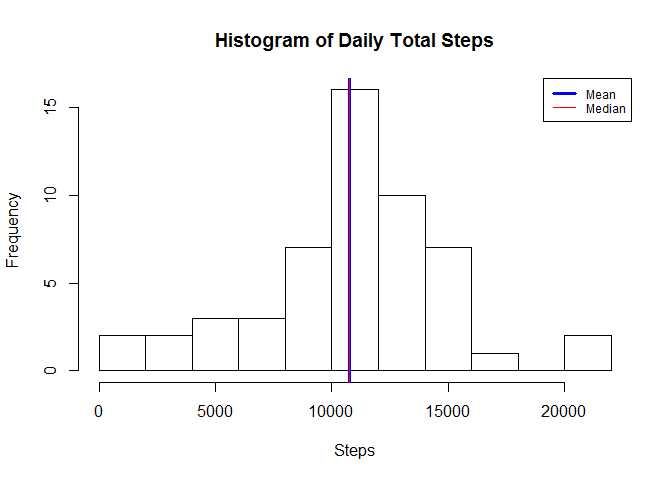
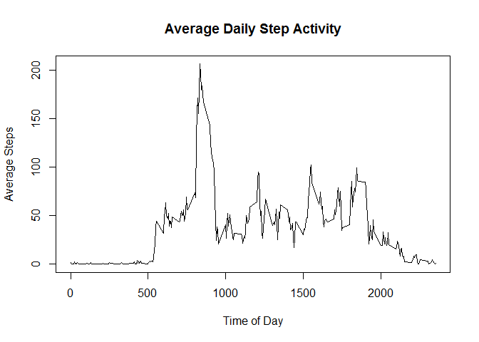
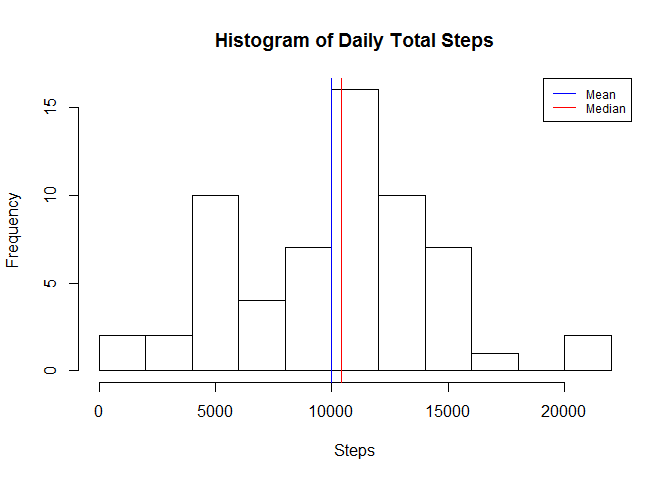
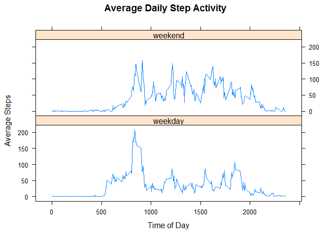

# Reproducible Research: Peer Assessment 1

This document discusses an exploratory data analysis of the activity.zip file included in this repo. As per the requirements of the assignment, all code and output are displayed.

## Loading and preprocessing the data

First, we load the data into a data frame, called "activity". Using str, we can see what the raw data look like.


```r
activity <- read.csv(unz("activity.zip", "activity.csv"))
str(activity)
```

```
## 'data.frame':	17568 obs. of  3 variables:
##  $ steps   : int  NA NA NA NA NA NA NA NA NA NA ...
##  $ date    : Factor w/ 61 levels "2012-10-01","2012-10-02",..: 1 1 1 1 1 1 1 1 1 1 ...
##  $ interval: int  0 5 10 15 20 25 30 35 40 45 ...
```

Next, we will add a column called "timestamp" that converts the date and interval variables into a single posixct object for each observation. First, we'll need to transform the interval variable to strings of matching length. 0 will become "0000", 5 "0005", up to 2355 into "2355".

```r
##transform interval to format "0000", "0005", "0010", etc.
##format = "d" indicates interval is currently an integer, 
##and flag appends 0s as necessary to the front of the string.
intervalStrings <- formatC(activity$interval, width = 4, format = "d", flag = "0")

##paste date and intervalStrings, and convert to date object using strptime
activity$timestamp <- paste(activity$date, intervalStrings)
activity$timestamp <- strptime(activity$timestamp, format = "%Y-%m-%d %H%M")

rm(intervalStrings)
```

## What is mean total number of steps taken per day?

For this we will make a histogram of the daily totals for steps using the base plotting system, along with lines showing the mean and median number of steps. These calculations will ignore days for which there are no observed step data.


```r
##plot histogram with titles, mean and median lines, and legend
hist(with(activity, tapply(steps, date, sum)), breaks = 10,
     main = "Histogram of Daily Total Steps", xlab = "Steps")
abline(v = mean(with(activity, tapply(steps, date, sum)), na.rm = TRUE), 
       col = "blue", lwd = 3)
abline(v = median(with(activity, tapply(steps, date, sum)), na.rm = TRUE), 
       col = "red")
legend("topright", lwd=c(3,1), col = c("blue", "red"), 
       legend = c("Mean", "Median"), cex = .75)
```

<!-- -->

```r
##calculate mean and median for output below
stepMean <- mean(with(activity, tapply(steps, date, sum)), na.rm = TRUE)
stepMedian <-median(with(activity, tapply(steps, date, sum)), na.rm = TRUE)
```

As shown on the histogram, the mean and median daily step totals are very close. The mean number of steps is about 10766. The median number of steps is 10765.

## What is the average daily activity pattern?

The first step will be to calculate the means based on the intervals. Then it's a pretty straightforward plot.


```r
intMeans <- with(activity, aggregate(steps, list(interval), mean, na.rm = TRUE))
plot(intMeans$Group.1, intMeans$x, type = "l", xlab = "Time of Day",
     ylab = "Average Steps", main = "Average Daily Step Activity")
```

<!-- -->

```r
rm(intMeans)
```

## Imputing missing values

As mentioned before, the activity dataset is missing some observations of number of steps taken during some days and intervals. Specifically, 2304 observations are missing, all in the steps variable. The portion of steps data which is missing is 0.1311475.

To impute the missing values we can use the impute package available at http://bioconductor.org. Here, we'll subset the steps, date, and interval variables, and then convert that subset into a matrix. Then, we can impute the missing step values using the k nearest neighbors. Afterwards, we can build a new dataset, activity2, using the imputed values to fill in the missing data.


```r
library(impute)

##create matrix for imputing missing values
matrix <- data.matrix(subset(activity, select = c("steps", "date", "interval")))
imputed <- impute.knn(matrix)$data
```

```
## Cluster size 17568 broken into 8784 8784 
## Cluster size 8784 broken into 4445 4339 
## Cluster size 4445 broken into 2250 2195 
## Cluster size 2250 broken into 1050 1200 
## Done cluster 1050 
## Done cluster 1200 
## Done cluster 2250 
## Cluster size 2195 broken into 862 1333 
## Done cluster 862 
## Done cluster 1333 
## Done cluster 2195 
## Done cluster 4445 
## Cluster size 4339 broken into 2195 2144 
## Cluster size 2195 broken into 980 1215 
## Done cluster 980 
## Done cluster 1215 
## Done cluster 2195 
## Cluster size 2144 broken into 2044 100 
## Cluster size 2044 broken into 1174 870 
## Done cluster 1174 
## Done cluster 870 
## Done cluster 2044 
## Done cluster 100 
## Done cluster 2144 
## Done cluster 4339 
## Done cluster 8784 
## Cluster size 8784 broken into 4401 4383 
## Cluster size 4401 broken into 2275 2126 
## Cluster size 2275 broken into 2007 268 
## Cluster size 2007 broken into 844 1163 
## Done cluster 844 
## Done cluster 1163 
## Done cluster 2007 
## Done cluster 268 
## Done cluster 2275 
## Cluster size 2126 broken into 929 1197 
## Done cluster 929 
## Done cluster 1197 
## Done cluster 2126 
## Done cluster 4401 
## Cluster size 4383 broken into 2187 2196 
## Cluster size 2187 broken into 976 1211 
## Done cluster 976 
## Done cluster 1211 
## Done cluster 2187 
## Cluster size 2196 broken into 1220 976 
## Done cluster 1220 
## Done cluster 976 
## Done cluster 2196 
## Done cluster 4383 
## Done cluster 8784
```

```r
##create new dataset with imputed data
activity2 <- activity
activity2$steps <- imputed[,1]
rm(matrix, imputed)
```

Using our new data, we can replot the histogram of daily step totals to see how the mean and median have changed.


```r
##plot histogram with titles, mean and median lines, and legend
hist(with(activity2, tapply(steps, date, sum)), breaks = 10,
     main = "Histogram of Daily Total Steps", xlab = "Steps")
abline(v = mean(with(activity2, tapply(steps, date, sum))), col = "blue")
abline(v = median(with(activity2, tapply(steps, date, sum))), col = "red")
legend("topright", lwd=c(1,1), col = c("blue", "red"), 
       legend = c("Mean", "Median"), cex = .75)
```

<!-- -->

```r
##calculate mean and median for output below
stepMean2 <- mean(with(activity2, tapply(steps, date, sum)))
stepMedian2 <-median(with(activity2, tapply(steps, date, sum)))
```

As shown on the histogram, both the mean and median daily step totals have decreased slightly, the mean decreasing by more. The mean number of steps is now about 10003. The median number of steps is now 10395. Overall, imputing the missing data made only about a five percent difference in the daily step total averages.


## Are there differences in activity patterns between weekdays and weekends?

Using the timestamp variable we introduced in preprocessing, we can add another factor variable indicating "weekend" or "weekday" for each observation. After calculating the mean steps for each time interval and day type, we can use a lattice plot to see the differences between the two day types.


```r
##set daytype variable to "weekend" or "weekday" based on timestamp
activity2$daytype <- ifelse(weekdays(activity2$timestamp) %in% 
                            c("Saturday","Sunday"), "weekend", "weekday")

##calculate means per interval and daytype
intMeans <- with(activity2, aggregate(steps, list(interval, daytype), mean))

##plot with lattice
library(lattice)
xyplot(x ~ Group.1 | Group.2, data = intMeans, type = "l", layout = c(1,2),
       xlab = "Time of Day", ylab = "Average Steps", 
       main = "Average Daily Step Activity")
```

<!-- -->

```r
rm(intMeans)
```

From the plot we can see clear differences between weekday and weekend data. The weekend data includes moderate peaks throughout the day, whereas the weekday data indicates a fairly defined schedule. Given the location of the peaks in the weekday data, one could hypothesize that during these two months, the subject had a routine of morning exercise, and a standard workday routine with a lunch around noon and evenings free. The subject seems to have mostly slept from around 10:00pm to 6:00am daily, but may have slept in longer on some weekend mornings.
